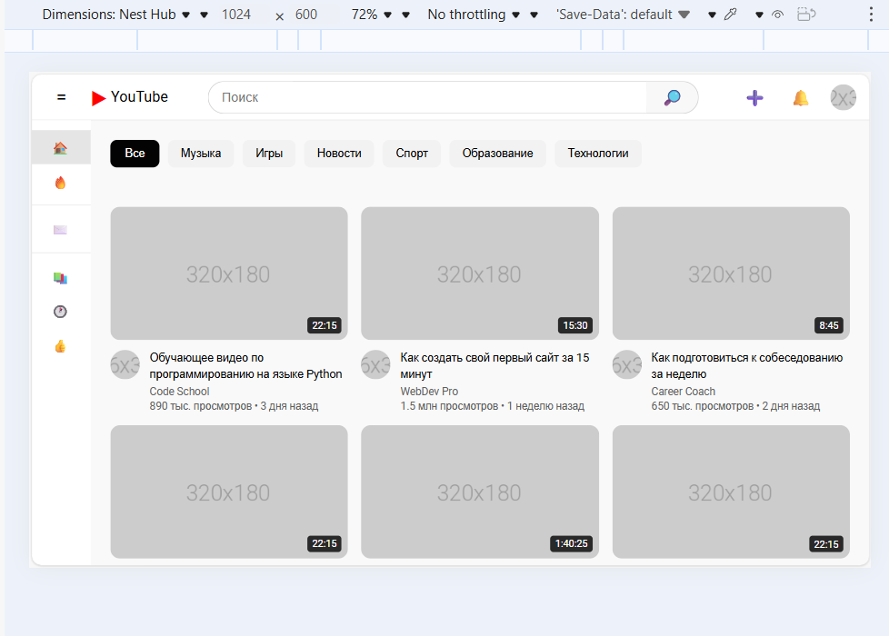
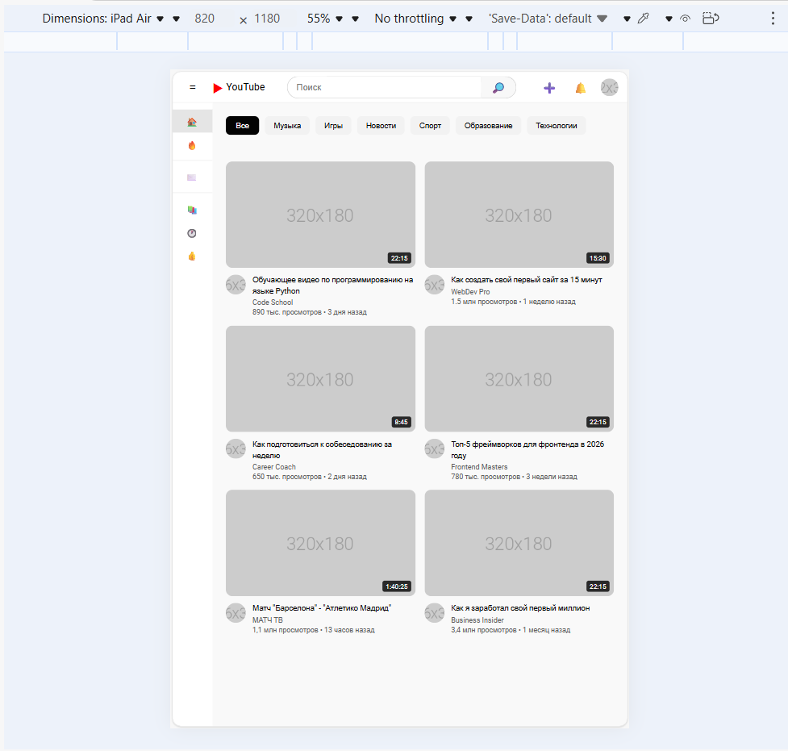
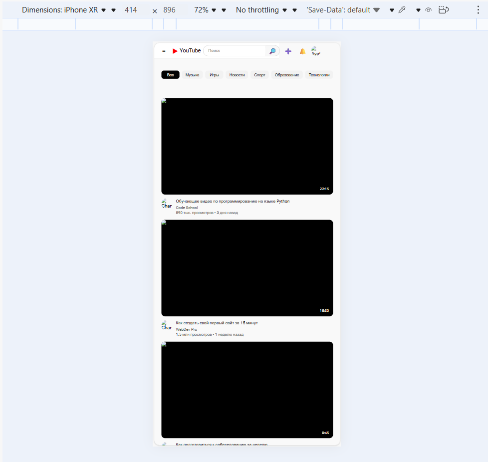

# YouTube Clone - Лабораторная работа №9-10
**Студент:**
Заставная Наталия Владимировна
**Группа:**
ИСП-231

## Описание
Адаптивный клон главной 
страницы YouTube, созданный с использованием HTML, CSS, Flexbox и CSS Grid. Реализован фирменный стиль оформления YouTube, добавлены разделы и вкладки меню.

---

## Реализованные функции
- [ ] Адаптивный хедер с поиском 
- [ ] Боковая панель навигации
- [ ] Категории (чипсы) с интерактивностью
- [ ] Сетка видео с карточками
- [ ] Hover-эффекты на карточках
- [ ] Полная адаптивность под все устройства
- [ ] Замена заглушек на реальные изображения
- [ ] Добавление категорий в блок .chips
---

## Технологии
- HTML5
- CSS3
- Flexbox
- CSS Grid
- Media Queries

---

## Скриншоты
### Desktop (1024px)

### Tablet (820px)

### Mobile (414px)

---

## Как запустить
1.Откройте файл `index.html` в браузере
2.Или используйте **Live Server** в VS Code:
- Установите расширение Live Server
- Правой кнопкой по `index.html`→ Open with Live Server
---
## Структура проекта
+ `index.html` - основной HTML-файл проекта
+ `style.css` - файл стилей элементов веб-страницы
+  [README.md](#youtube-clone---лабораторная-работа-9-10) - файл с описанием проекта
+ папка `img` со скриншотами, относящимся к проекту
## Вывод
В ходе выполнения лабораторной работы я изучила основы адаптивной вёрстки, 
освоила работу с Flexbox и CSS Grid. Также с помощью CSS я научилась создавать интерактивные элементы.

Создание проекта помогло мне не только изучить, но и применить на практике полученные знания путем создания современных интерфейсов.

---
## Дата выполнения
15.02.2026